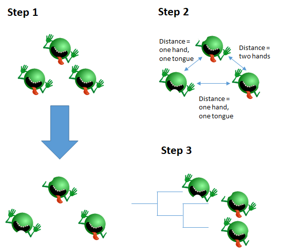
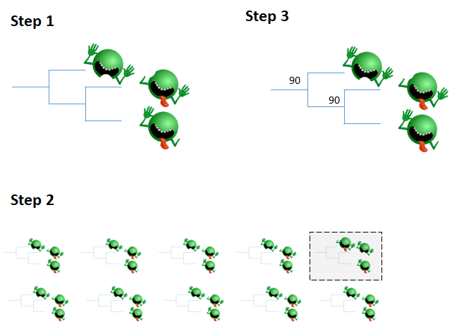
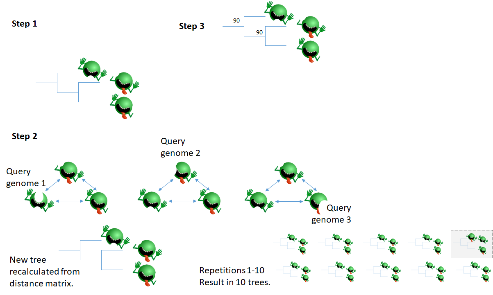

# Summary

In the past decade, the number of publically available bacterial genomes has increased dramatically.
In the past few years, these genomes have increasingly been generated for impactful initiatives, especially genomic epidemiology **GenFS REF**.
Genomes are sequenced, shared publicly, and consequently analyzed for phylogenetic relatedness.
If two genomes of epidemiological interest are found to be related, further investigation might be prompted.
However, comparing the multitudes of genomes for shared phylogeny is computationally expensive and in many ways intractable.  

However, there are many strategies to reduce the complexity of the data.  One strategy is to create multilocus sequence type (MLST) profiles from each genome as it is sequenced.  In MLST analysis, only the allelic variants are analyzed, reducing the complexity per genome from millions of base pairs to either seven genes or thousands of genes `[@Moura:2017]`.  Another strategy is to assemble each genome such that the hundreds of thousands of reads per genome is compressed into a contiguous sequence.  Starting from the assembly, creating a genome-wide multiple sequence alignment becomes more simplified.  One example is the speed and accuracy is how the assembler Skesa is used in the Pathogen Detection Pipeline website `[@Souvorov:2018]`.  Yet another classic strategy is reducing each genome down to split kmers.  Split kmers have been been implemented in many software packages including KSNP `[@Gardner:2015]` and SKA `[@Harris:2018]`.

Recently an algorithm called min-hash was codified into the Mash package which helps simplify the vast genomic data further `[@Ondov:2016]`.  In the min-hash algorithm, all nucleotides of length _k_ (kmers) are recorded and transformed into an integer using an algorithm called hashing.  These hashed kmers are sorted and only the first several kmers are retained.  The semi-random kmers that appear at the top of the sorted list is collectively called the sketch.  To compare two genomes that have been sketched with the min-hash algorithm is to compare how many hashed kmers they have in common.  Therefore, the min-hash algorithm can yield a very fast, computationally inexpensive distance between any two genomes.

Creating a dendrogram from genome distances is encoded in several algorithms.  One widely used algorithm is neighbor-joining (NJ) `[@Saitou:1987]`.  The NJ algorithm reads a set of genomes and iterates over their distances.  Each genome starts as a leaf node in a star-like tree.  In each iteration of NJ, the most related genomes (neighbors) are identified and are given a common node on the growing tree.  Then, new distances are calculated between all nodes and the new node.  The product of the NJ algorithm is a binary tree, where each node except the root has one parent node and zero or two children.

Because min-hash creates distances between any two genomes and because NJ uses distances to create trees, min-hash values can be used to create trees.  We have implemented this idea in software called Mashtree which creates rapid trees.  

# Implementation

## Base workflow

Mashtree builds on two major algorithms that are already codified.  The first is the min-hash algorithm, which is codified in the software Mash.  Mash sketches the genomes with the function `mash sketch`.  We elected to keep most default Mash options but to change the stack size (number of hashed kmers) from 1,000 to 10,000 to increase discriminatory power.  Then, mash calculates the distances between genomes with `mash dist`.  These distances are recorded in a Mash distance matrix.  The second algorithm is neighbor-joining (NJ) which is implemented in the software QuickTree `[@Howe:2002]`.  All default QuickTree options are used, and it reads the Mash distance matrix as input.  The workflow is depicted in Figure 1.

## Fast or accurate mode

While Mashtree has been developed for speed, some might want higher accuracy.  In response, we have implemented an optional minimum abundance filter for raw read input files.  This filter creates a histogram of kmers using Mash and detects the valleys between peaks.  The first peak of a kmer histogram represents kmers that occur only once or rarely.  These "rare" kmers usually represent sequencing errors.  Therefore the minimum abundance filter can optionally be used to see where the first valley is and automatically set that parameter for the minimum kmer coverage that Mash reports.  Using this filter therefore helps avoid noise in the input data.  Running accurate mode is shorthand for running Mashtree with the minimum abundance filter turned on.  Otherwise by default, a user is running fast mode.

## Confidence values

We have implemented two methods of confidence values in Mashtree.  In both methods, the tree is created per the normal workflow.  Then, in the bootstrapping method (Figure 2), the tree is created again once per repetition.  In each repetition, the random seed for Mash is changed randomly.  Therefore, distances will vary randomly between repetitions, and the repetition tree will vary.

In the jackknife method for each repetition, each genome is picked one at a time as the query genome (Figure 3).  Its hashes are sampled without replacement for half of the original hashes.  Then, a Mash distance is recomputed between the query genome and all other genomes in the analysis.  After all genomes have been analyzed as the query in this way, an average distance is computed between all genomes.  This new distance matrix is used for a NJ tree.   

For repetitions in either the bootstrap or jackknife trees, for each parent node in the original tree, a percentage of how often the exact descendents are present is recorded and applied in the final dendrogram file.  The bootstrapping method is implemented in `mashtree_bootstrap.pl`, and the jackkniffing method is implemented in `mashtree_jackknife.pl`.

## Other features

Mashtree has several useful features.  First, Mashtree can read any major sequence file type and can read gzip-compressed files.  This is a major advantage in being compatible with a wide variety of databases and in being compatible with space-saving file compression.  Second, Mashtree takes advantage of multithreading.  The number of requested threads is used to determine how many genomes are sketched at the same time and how many sketches can be compared at the same time.  When the number of threads requested is a multiple of the number of input genomes, Mashtree uses multithreaded Mash sketches and distances.  Third, Mashtree uses an SQLite database which can be used to cache results between runs.

# Installation

The Mashtree package is programmed in Perl, and is available in the CPAN repository.  Documentation can be found at https://github.com/lskatz/mashtree.  

# Figures

  
**Figure 1.  The Mashtree workflow.**  
*Step 1.* Sketch genomes with Mash. In this analogy, there is an image of each genome.  In the subsequent images, the "sketches," there is a piece of the genome missing.  
*Step 2.* calculate distances with `Mash dist`.  
*Step 3.* create dendrogram with Quicktree.  

  
**Figure 2.  The Mashtree bootstrap workflow.**  
*Step 1.* Generate a tree with the normal workflow (Figure 1).  Save the Mashtree tree.  
*Step 2.* Run the normal workflow once per repetition but with a different random seed. In this example, the top right repetition differs from the main tree.  All ten of these trees are the bootstrap trees.  
*Step 3.* For each parent node in the first tree, quantify how often the bootstrap trees have the same children.  Record that percentage next to each parent node.  This percentage quantifies how confident Mashtree is at clustering, controlling for the random seed in the Mash program.

  
**Figure 3.  The Mashtree jackknife workflow.**  
*Step 1.* Generate a tree with the normal workflow (Figure 1).  Save the Mash hashes.  
*Step 2.* For each repetition, sample the half hashes of one genome at a time without replacement.  This genome is the query genome.  Recalculate the Mash distance between the query genome and all other genomes, reducing the denominator to one half to reflect the smaller pool of hashes.  After all genomes have been selected for query genomes, average the distances to create a new distance matrix.  Create the dendrogram from the new distance matrix.  For brevity, only one repetition is shown.  
*Step 3.* For each parent node in the first tree, quantify how often the bootstrap trees have the same children.  Record that percentage next to each parent node.  This percentage quantifies how confident Mashtree is at clustering, controlling for the random seed in the Mash program.

# Acknowledgements

This work was made possible through support from the Advanced Molecular Detection (AMD) Initiative at the Centers for Disease Control and Prevention.  Thank you Sam Minot, Andrew Page, and Torsten Seemann for helpful discussions.

# References
